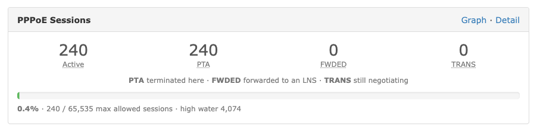
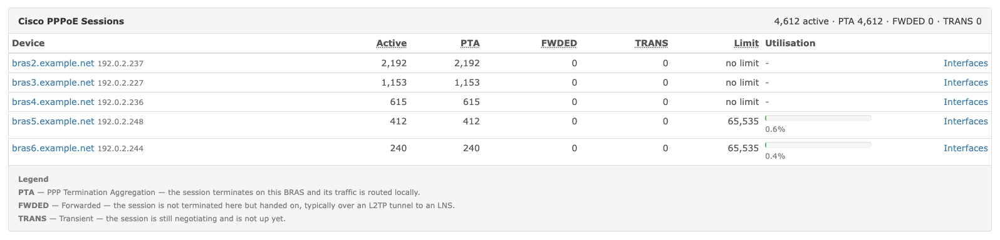
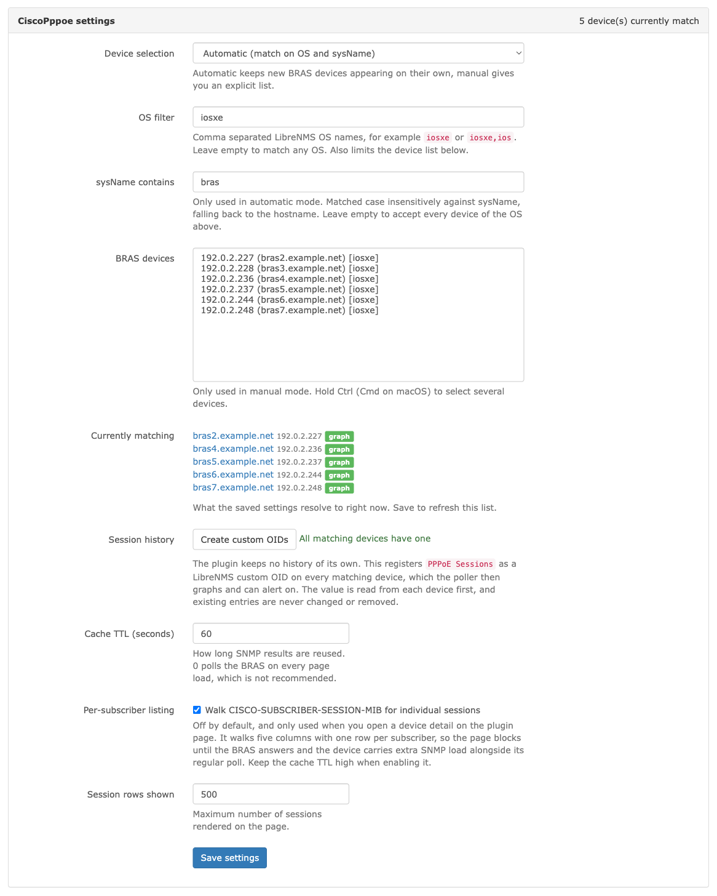
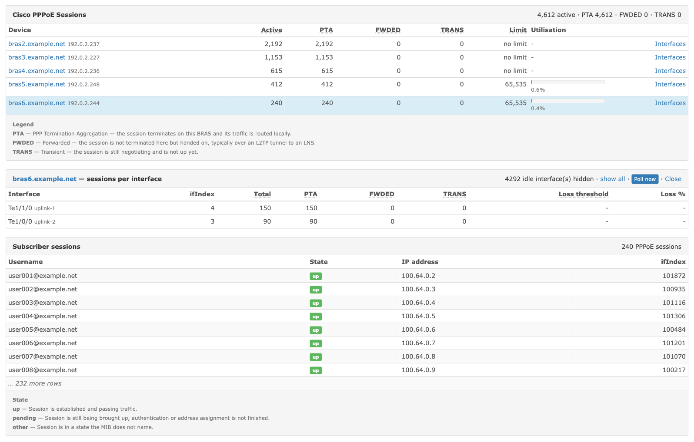

# CiscoPppoe

PPPoE session overview for Cisco ASR1000 (IOS-XE) BRAS devices, as a LibreNMS v2 plugin.

[](LICENSE)


Adds a session panel to the device overview, a page listing every BRAS with a
per-interface drill-down, an opt-in per-subscriber listing, and a one-click way to
register the session count as a LibreNMS custom OID so it gets graphed.





## Contents

- [Requirements](#requirements)
- [Installation](#installation)
- [Settings](#settings)
- [How data is collected](#how-data-is-collected)
- [Session history and graphs](#session-history-and-graphs)
- [OIDs used](#oids-used)
- [Troubleshooting](#troubleshooting)
- [Contributing](#contributing)
- [License](#license)

## Requirements

- LibreNMS with v2 plugin support (`app/Plugins/`), developed against **26.8**
- SNMP access to the BRAS, using the credentials the device already has in LibreNMS
- Cisco IOS-XE with `CISCO-PPPOE-MIB`, verified on **ASR1000 / IOS-XE 15.5(3)S**

Check a device answers before installing anything:

```bash
snmpwalk -v2c -c <community> <bras-ip> .1.3.6.1.4.1.9.9.194.1.1.1.0
```

## Installation

> [!IMPORTANT]
> Do not use `/data/plugins`. In `librenms/docker` that path maps to `html/plugins/`,
> which is the **legacy v1** plugin system. v2 plugins live in `app/Plugins/`.

Clone on the Docker host and bind mount it into the container:

```bash
git clone https://github.com/jozefrebjak/librenms-plugin-cisco-pppoe.git \
  /opt/librenms/plugins/CiscoPppoe
chown -R 1000:1000 /opt/librenms/plugins/CiscoPppoe
```

The uid/gid must match the `librenms` user inside the container.

```yaml
# docker-compose.yml
services:
  librenms:
    volumes:
      - /opt/librenms/plugins/CiscoPppoe:/opt/librenms/app/Plugins/CiscoPppoe
```

The plugin reads SNMP when a page is rendered and has no poller component, so it does
not need mounting into `dispatcher`.

```bash
cd /opt/librenms
docker compose up -d librenms
docker compose exec -u librenms librenms php artisan optimize:clear
```

> [!WARNING]
> Run artisan as the `librenms` user. As root it aborts, and can leave root-owned
> files in `bootstrap/cache` that break the web UI until you `chown` them back.

Enable the plugin under **Overview → Plugins**, then configure it with the *Settings*
button next to it.

## Settings



| Setting | Default | Description |
|---|---|---|
| Device selection | `Automatic` | `Automatic` matches on OS and sysName, `Manual` uses an explicit device list |
| OS filter | `iosxe` | Comma separated LibreNMS OS names. Empty matches any OS. Also limits the manual device picker |
| sysName contains | `bras` | Substring of sysName, case insensitive, falling back to the hostname |
| BRAS devices | — | Explicit device list, only used in `Manual` mode |
| Cache TTL | `60` s | How long SNMP results are reused. `0` disables caching |
| Per-subscriber listing | off | Enables the `CISCO-SUBSCRIBER-SESSION-MIB` walk |
| Session rows shown | `500` | How many rows the listing renders, capped at 20000 |

*Currently matching* shows what the saved filters actually resolve to, so you can tell
a wrong filter from a device that is simply not answering.

## How data is collected

LibreNMS v2 plugin hooks are UI only — there is no poller hook a local plugin can
implement — so nothing runs on a schedule by default.

| Data | When it is collected | Cost |
|---|---|---|
| Session counters | On demand when the cache is cold | One snmpget plus one walk of the physical interfaces |
| Per-interface breakdown | Same as above | Included in that walk |
| Per-subscriber listing | Never during a page render | Four walks, one row per subscriber |

The subscriber listing is read from cache only, so opening a device never waits on
SNMP. When the cache is empty it offers a **Poll the BRAS now** button.



Idle interfaces are hidden by default. On an ASR1000 the per-interface table covers
every sub-interface, which buries the handful that carry sessions.

### Optional: collect in the background

If you want the subscriber listing ready without clicking, run the warm-cache script
from cron on the Docker host, at an interval shorter than the cache TTL:

```cron
*/5 * * * * cd /opt/librenms && docker compose exec -T -u librenms librenms php /opt/librenms/app/Plugins/CiscoPppoe/bin/warm-cache.php >/dev/null 2>&1
```

Try it by hand first:

```bash
cd /opt/librenms
docker compose exec -T -u librenms librenms php /opt/librenms/app/Plugins/CiscoPppoe/bin/warm-cache.php
```

Set **Cache TTL** to at least twice the cron interval, otherwise entries expire between
runs. Skip the cron entirely if you only open the page occasionally — it would poll the
BRAS for nobody.

## Session history and graphs

The plugin stores nothing, so on its own it shows no trend. LibreNMS can: the
`customoid` poller module is enabled by default, so anything in the `customoids` table
is polled into RRD, graphed and alertable.

Settings has a **Create custom OIDs** button that registers `cPppoeSystemCurrSessions`
on every matching BRAS. The value is read from each device first, so the poller never
inherits an OID the device does not answer.

> [!NOTE]
> It only ever adds. Existing entries, whether created by the plugin or by hand, are
> never modified or deleted, so no RRD history is lost. Removing one is a manual job
> under *Device → Edit → Custom OID*.

After the next poll the graph appears under *Device → Graphs → Custom OID*, and the
plugin links to it from the overview panel and the settings device list.

<details>
<summary>Adding it by hand instead</summary>

Under *Device → Edit → Custom OID*:

- **OID:** `.1.3.6.1.4.1.9.9.194.1.1.1.0`
- **Data Type:** `GAUGE`
- **Unit:** `sessions`

Other values worth graphing this way, none of which the button creates:

| Value | OID | Data Type |
|---|---|---|
| Highest concurrent count | `.1.3.6.1.4.1.9.9.194.1.1.2.0` | `GAUGE` |
| Sessions refused at the limit | `.1.3.6.1.4.1.9.9.194.1.1.5.0` | `COUNTER` |

The PTA / FWDED / TRANS split is per interface only, so graphing it would need one
custom OID per ifIndex. That is not practical, which is why the plugin shows it live.

</details>

## OIDs used

Derived with `snmptranslate` from the official Cisco MIB files in [`mibs/`](mibs/) and
checked against a live ASR1000. The plugin polls **numerically** — those files are
reference material and are never loaded at runtime.

### CISCO-PPPOE-MIB (`1.3.6.1.4.1.9.9.194`)

| OID | Object | Description |
|---|---|---|
| `.1.3.6.1.4.1.9.9.194.1.1.1.0` | `cPppoeSystemCurrSessions` | Sessions currently active on the device |
| `.1.3.6.1.4.1.9.9.194.1.1.2.0` | `cPppoeSystemHighWaterSessions` | Highest concurrent count seen |
| `.1.3.6.1.4.1.9.9.194.1.1.3.0` | `cPppoeSystemMaxAllowedSessions` | Session limit |
| `.1.3.6.1.4.1.9.9.194.1.1.4.0` | `cPppoeSystemThresholdSessions` | Trap watermark |
| `.1.3.6.1.4.1.9.9.194.1.1.5.0` | `cPppoeSystemExceededSessionErrors` | Sessions refused at the limit |
| `.1.3.6.1.4.1.9.9.194.1.4.1.1` | `cPppoeSessionsPerInterfaceEntry` | Indexed by ifIndex, columns 1–6: total, PTA, FWDED, TRANS, loss threshold, loss % |

> [!NOTE]
> The MIB says an unconfigured session limit is `0`, but IOS-XE 15.5(3)S also reports
> the Unsigned32 maximum `4294967295`. Both are treated as *no limit*.

### CISCO-SUBSCRIBER-SESSION-MIB (`1.3.6.1.4.1.9.9.786`)

| OID | Object | Notes |
|---|---|---|
| `.1.3.6.1.4.1.9.9.786.1.1.1.1.1` | `csubSessionType` | PPPoE = `4`, confirmed on IOS-XE 15.5(3)S |
| `.1.3.6.1.4.1.9.9.786.1.1.1.1.3` | `csubSessionState` | `1` other, `2` pending, `3` up |
| `.1.3.6.1.4.1.9.9.786.1.1.1.1.13` | `csubSessionNativeIpAddr` | Walked with forced hex output |
| `.1.3.6.1.4.1.9.9.786.1.1.1.1.24` | `csubSessionUsername` | |
| `.1.3.6.1.4.1.9.9.786.1.1.1.1.10` | `csubSessionMacAddress` | Not walked, IOS-XE 15.5(3)S returns an empty string |

`csubSessionTable` (`.1.3.6.1.4.1.9.9.786.1.1.1`) is `MAX-ACCESS not-accessible`, so
walking the table OID returns nothing — go to the columnar objects instead.

The full annotated list is in [`Support/Oids.php`](Support/Oids.php).

## Glossary

| Term | Meaning |
|---|---|
| **PTA** | PPP Termination Aggregation — the session terminates on this BRAS and its traffic is routed locally |
| **FWDED** | Forwarded — not terminated here but handed on, typically over an L2TP tunnel to an LNS |
| **TRANS** | Transient — still negotiating, not up yet |

## Troubleshooting

<details>
<summary>The plugin does not appear in the UI</summary>

```bash
docker compose exec -u librenms librenms php artisan optimize:clear
```

Check the file names. The structure is case sensitive and validated before install.

</details>

<details>
<summary>The settings page shows "Missing view"</summary>

The settings hook returned nothing, which normally means `authorize()` returned false
or the hook threw. Check `logs/librenms.log`, and turn on plugin errors:

```bash
docker compose exec -u librenms librenms php artisan config:set plugins.show_errors true
```

</details>

<details>
<summary>The plugin disabled itself</summary>

LibreNMS disables a plugin that throws. Enable `plugins.show_errors` as above and read
`logs/librenms.log`.

</details>

<details>
<summary>The panel does not appear on a device</summary>

`DeviceOverview::authorize()` returns false when the device does not match the
selection or returns no data. Verify that:

1. the device matches the OS and sysName filters, or is in the manual list,
2. `snmpwalk -v2c -c <community> <ip> .1.3.6.1.4.1.9.9.194.1.1.1.0` returns a value,
3. the device is not disabled.

</details>

<details>
<summary>The numbers are stale</summary>

Data is cached for the configured TTL. The device detail has a **Poll now** button that
refreshes that device immediately.

</details>

<details>
<summary>The per-interface table is empty but the total is right</summary>

Some IOS-XE versions do not populate `cPppoeSessionsPerInterfaceTable`. The total then
comes from `cPppoeSystemCurrSessions` and the PTA/FWDED/TRANS split stays at zero.

</details>

<details>
<summary>The subscriber listing is empty</summary>

The plugin keeps only rows where `csubSessionType` is `4` (PPPoE). Check what your
platform reports:

```bash
snmpbulkwalk -v2c -c <community> <bras-ip> .1.3.6.1.4.1.9.9.786.1.1.1.1.1 | head
```

</details>

## Contributing

See [CONTRIBUTING.md](CONTRIBUTING.md). It covers the constraints that are specific to
LibreNMS plugins, including why only hook classes may live in the plugin root.

## License

[MIT](LICENSE)

The MIB files under [`mibs/`](mibs/) are published by Cisco Systems and are included
unmodified for reference; they are not covered by this licence.
